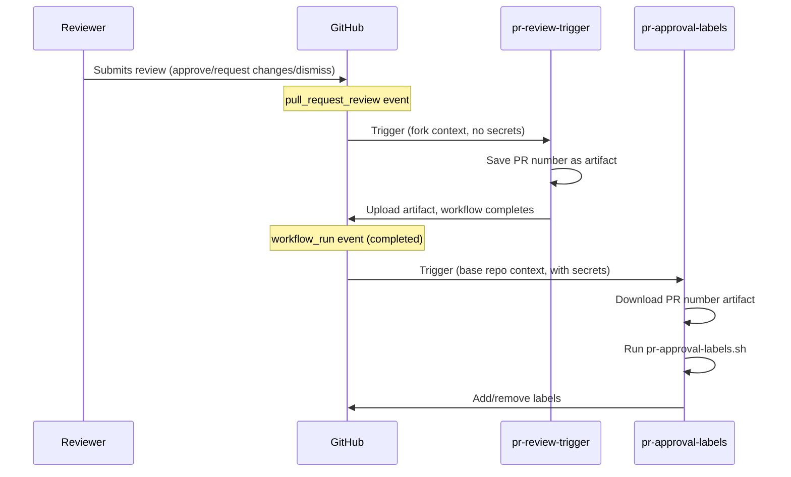
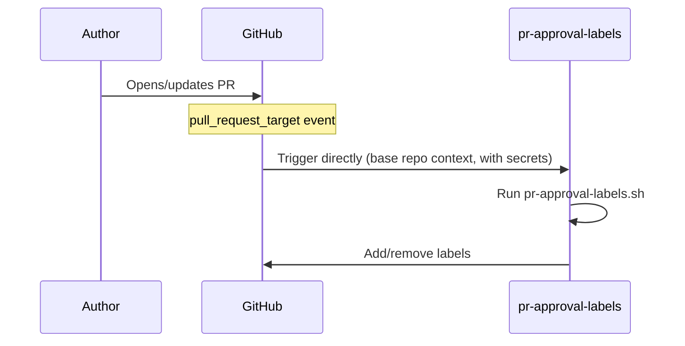

All workflow files live under
[`.github/workflows/`](https://github.com/open-telemetry/opentelemetry.io/tree/main/.github/workflows).

## PR approval labels {#pr-approval-labels}

Two workflows work together to automatically manage approval-related labels on
pull requests:

| Workflow file                      | Trigger                               | Privileges                                   |
| ---------------------------------- | ------------------------------------- | -------------------------------------------- |
| [`pr-review-trigger.yml`][trigger] | `pull_request_review`                 | Minimal (no secrets)                         |
| [`pr-approval-labels.yml`][labels] | `pull_request_target`, `workflow_run` | App token for label edits and org/team reads |

[trigger]:
  https://github.com/open-telemetry/opentelemetry.io/blob/main/.github/workflows/pr-review-trigger.yml
[labels]:
  https://github.com/open-telemetry/opentelemetry.io/blob/main/.github/workflows/pr-approval-labels.yml

### Labels managed

- **`missing:docs-approval`** — added when approval from the
  [`docs-approvers`][docs-approvers] team is pending; removed once a
  docs-approver approves.
- **`missing:sig-approval`** — added when approval from a SIG team is pending
  (determined by files changed and [`.github/component-owners.yml`][owners]);
  removed once a SIG member approves or when no SIG component is touched.
- **`ready-to-be-merged`** — added when all required approvals are present;
  removed otherwise.

[docs-approvers]: https://github.com/orgs/open-telemetry/teams/docs-approvers
[owners]:
  https://github.com/open-telemetry/opentelemetry.io/blob/main/.github/component-owners.yml

### Why two workflows?

GitHub's `pull_request_review` event has no `_target` variant. This means a
workflow triggered by a review on a **fork PR** runs in the fork's context and
cannot access the base repository's secrets.

To work around this limitation, the system uses a
[`workflow_run` chaining pattern](https://docs.github.com/en/actions/writing-workflows/choosing-when-your-workflow-runs/events-that-trigger-workflows#workflow_run):

1. **`pr-review-trigger`** runs on every review submission/dismissal. It saves
   the PR number as an artifact and exits — no secrets needed.
2. **`pr-approval-labels`** is triggered by `workflow_run` (when the trigger
   workflow completes). It runs in the base repository context with full access
   to the GitHub App token, downloads the artifact, and updates labels.

For content changes (`opened`, `reopened`, `synchronize`), the
`pr-approval-labels` workflow is triggered directly via `pull_request_target`.

### Security model

- **`pr-review-trigger`**: intentionally minimal — no secrets, no privileged
  permissions. Ignores `review.state == "commented"` since comments don't affect
  approvals.
- **`pr-approval-labels`**: runs with a GitHub App token (`OTELBOT_DOCS_APP_ID`
  / `OTELBOT_DOCS_PRIVATE_KEY`) that has permissions to read org/team membership
  and edit PR labels. Uses `pull_request_target` and `workflow_run` to ensure it
  always executes in the trusted base repository context.

## PR fix directives {#pr-fix-directives}

The [`pr-actions.yml`][pr-actions] workflow lets contributors run selected `fix`
scripts by commenting on a PR:

- **`/fix`** runs `npm run fix`.
- **`/fix:<name>`** runs `npm run fix:<name>` (for example, `/fix:format`).
- **`/fix:all`** is mapped to `/fix` since the command semantics changed
  ([#9291][]).
- **`/fix:ALL`** is mapped to `fix:all` so that maintainers can run `fix:all`.

[#9291]: https://github.com/open-telemetry/opentelemetry.io/pull/9291

It runs as a two-stage pipeline:

1. **`generate-patch`** (untrusted): checks out the PR branch, runs the fix
   command, prunes the link refcache, and uploads a patch artifact
   (`pr-fix.patch`), up to 1024 KB.
2. **`apply-patch`** (trusted): runs with a GitHub App token, applies the patch,
   and pushes a commit to the PR branch.

If a directive produces no changes, a separate `notify-noop` job comments that
nothing needed to be committed.

[pr-actions]:
  https://github.com/open-telemetry/opentelemetry.io/blob/main/.github/workflows/pr-actions.yml

## Other workflows

The repository includes several other workflows:

| Workflow                   | Purpose                                       |
| -------------------------- | --------------------------------------------- |
| `check-links.yml`          | Sharded link checking using htmltest          |
| `check-text.yml`           | Textlint terminology checks                   |
| `check-i18n.yml`           | Localization front matter validation          |
| `check-spelling.yml`       | Spell checking                                |
| `auto-update-registry.yml` | Auto-update registry package versions         |
| `auto-update-versions.yml` | Auto-update OTel component versions           |
| `build-dev.yml`            | Development build and preview                 |
| `label-prs.yml`            | Auto-label PRs based on file paths            |
| `component-owners.yml`     | Assign reviewers based on component ownership |
